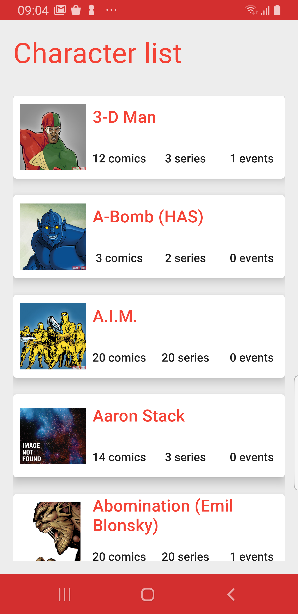
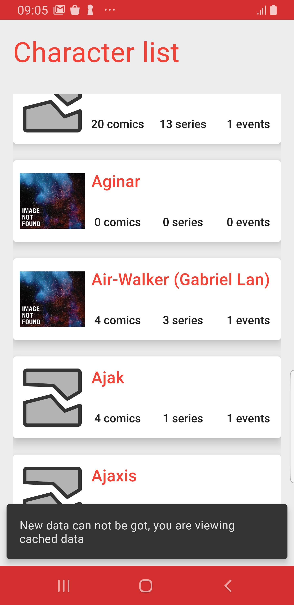
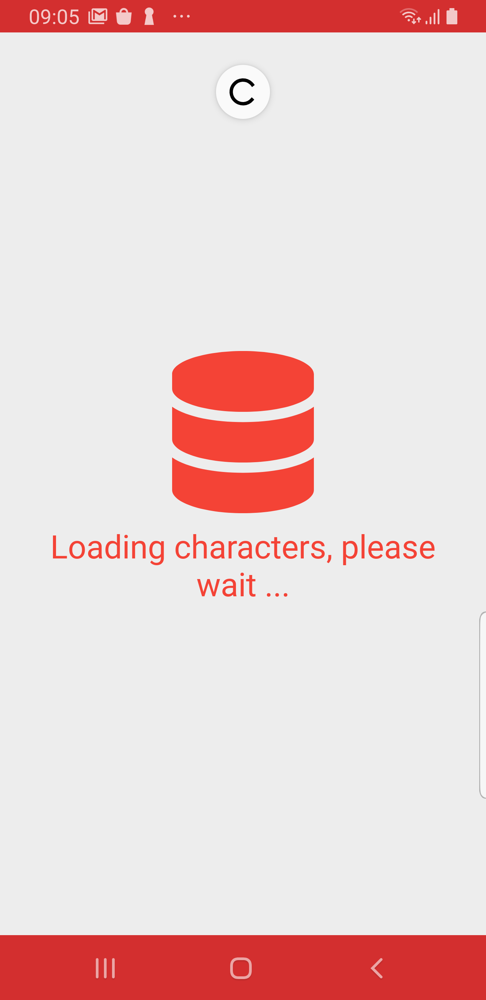
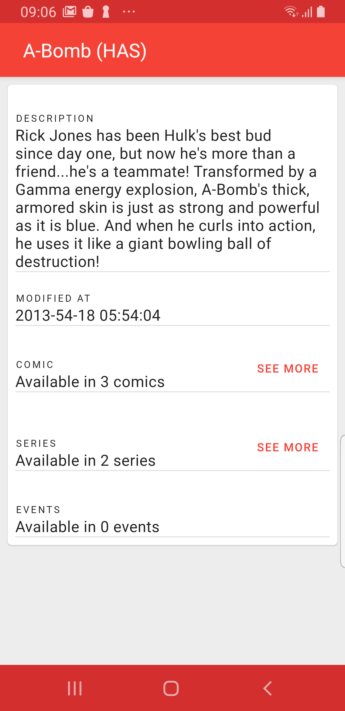
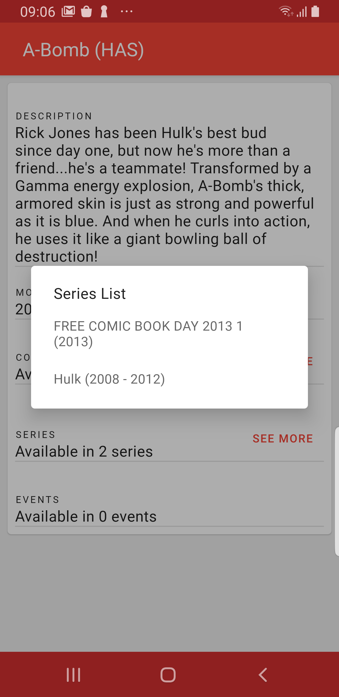
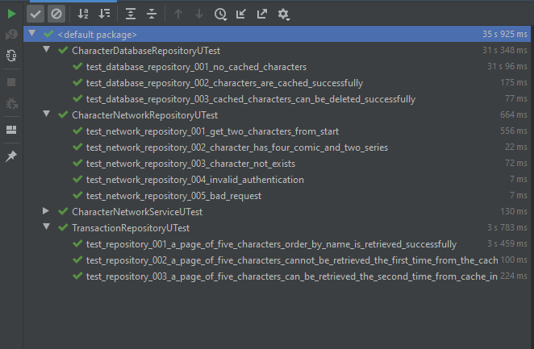

# Android Mobile Test

## Main Goals

* Clean architecure approach.
* Dependency injection through Dagger.
* Asynchronous operations management with cooroutines.
* Using Material Design guidelines.
* Using local storage to implement cache layer through repository pattern.
* Testing with mockito, assertj, junit..

 ## Tech stack & Open-source libraries
 - Minimum SDK level 23
 - 100% [Kotlin](https://kotlinlang.org/) based + [Coroutines](https://github.com/Kotlin/kotlinx.coroutines)
 - JetPack
   - LiveData - notify domain layer data to views.
   - Lifecycle - dispose observing data when lifecycle state changes.
   - ViewModel - UI related data holder, lifecycle aware.
 - Architecture
   - MVVM UI Architecture
   - Clean architecture approach with repository pattern
   - Dagger 2 - dependency injection
 - UI
    - ViewBinding
    - Material Design Components
    - Design based on Constraint Layout
 - Persistence
    - [Retrofit2 & Moshi](https://github.com/square/retrofit) - constructing the REST API
    - [OkHttp3](https://github.com/square/okhttp) - implementing interceptor, logging and mocking web server
    - [Room](https://developer.android.com/training/data-storage/room) -  persistence library
    - [Glide](https://github.com/bumptech/glide) - loading images

## Possible improvements.

* Using the Jetpack Paging library.
* UI Testing.

## Screenshots

### Character List

### Character Detail

## Tests

